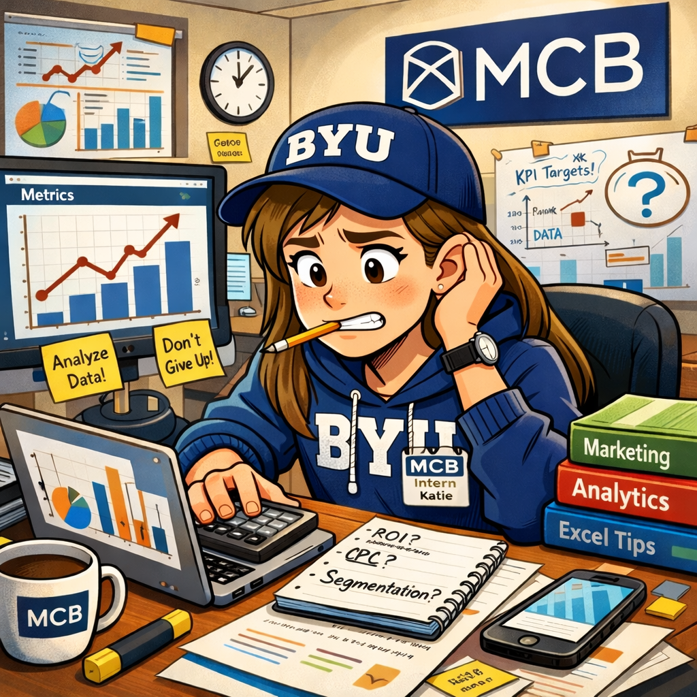

## Congratulations on Your New Job!

You are a new consultant with the MCB Consulting Group.

(Note: this is not an **actual** job, nor will you receive any monetary compensation.)

## MCB Was Founded in 2017

{width=800px}

## The Founders Began Moonlighting as BYU Profs. in 2024

{width=300px}

{width=300px}

## So We've Hired Co-CEOs to Help Run Things

{width=800px}

## And I've Hired You to Do Analytics!

{width=600px}

## You Will Interact with the CAO (Me) and our Senior Analytics Partners

{width=300px}

{width=300px}

## You Will Interact with the CAO (Me) and our Senior Analytics Partners

{width=300px}

{width=300px}

## Let's Dive In!

{width=400px}

## Marketing Analytics uses Data to Inform Managerial Decision Making

- What are the key managerial decisions in marketing?
- What is the difference between *inform* and *drive*?
- What are some examples of marketing analytics in practice?

To accomplish this, we will be learning to analyze data in R.

## If you "Show Up", You Can Obtain the Following (Learning Objectives)

- Increased faith in Jesus Christ, by which you will obtain the confidence and courage to not only program in R and conduct analyses, but to communicate results of those analyses in a way that is practical and relevant to business practice.
- The ability to conduct analyses with integrity by clearly documenting decision processes, identifying and communicating flaws in data and models, and quantifying uncertainty.
- Self-motivation to continually improve and to take responsibility for mistakes.
- The ability to recognize and develop excellence in your own analytical work and the work of others.

## You Will Submit Three Types of Deliverables for Evaluation

- Skill-Building Exercises
  - due at the start of every class
  - self-evaluation (I will provide a rubric)
- Knowledge Checks
  - About 25 multiple choice or fill-in-the-blank questions (Canvas)
  - Automatically graded
  - One due at the end of each unit
  
## You Will Submit Three Types of Deliverables for Evaluation

- Projects
  - A "client" provides data and a list of problems - you put together an analysis to address one of the problems
  - Evaluated by each senior analytics partner, given the average score
  - Includes an evaluation of another consultant's project

## FAQ | What am I expected to know *now*?

Nothing. (Well, nothing about coding.)

## FAQ | What makes this course different from MKTG 401?

- We focus on **secondary data** instead of **primary data**.
- Secondary data is messy and comes from many different sources.
- This course is a data analysis deep dive: more code, more details, more technical.

## FAQ | What makes this course different from MSB 325?

- This a deeper dive into data analysis.
- Class is interactive.
- Many students find they learn more.

## FAQ | Why are we using R?

R is a free, open-source programming language for statistical computing, analysis, and data science.

- Largest repository of established and new statistical techniques.
- Friendly for non-programmers.
- A very active and helpful community.
- What you can *do* with R is in high demand.

## FAQ | Would I Ever Use R Outside the Classroom?

**YES!**

[Google uses R.](https://www.linkedin.com/jobs/view/4321895082/)

[Netflix uses R.](https://explore.jobs.netflix.net/careers/job/790312518472?microsite=netflix.com)

## FAQ | What are we going to do? (What can I put on my resume?)

- Visualize, wrangle, and summarize data.
- Acquire data from a variety of sources (e.g., databases, APIs).
- Produce reports and interactive dashboards.
- Implement a variety of inferential and predictive models.
- Translate empirical results in managerial insights.

## FAQ | My internship/job expects me to know Python. How do I learn it?

Python is also a general-purpose data analysis tool, it just isn't as *accessible* as R is. However, many jobs require you to know Python.

- Programming techniques and experience learned in R will make learning additional languages *much* easier.
- The BYU Statistics department has excellent courses to teach you Python.
- If you are interested, I can provide access to resources for self-driven study.

## FAQ | How do I study for a class like this?

1. Seek learning by study and faith (D&C 109:7).
2. Prepare for meetings by previewing material and coming with questions.
3. Actively code, take notes, and ask questions during meetings.
4. Practice coding by completing exercises and referencing supplementary material as needed.
5. Review exercise solutions and note where and why your work differs.
6. Use the knowledge checks to gauge how well you understand the material.
7. Work with classmates and utilize office hours.
8. Download and organize all materials, notes, and code.

## FAQ | What's the best way to learn how to code?

1. Learn by doing: Code during meetings and complete exercises.
2. Pay *careful* attention to details. READ SLOWLY.
3. Don't code from scratch. Start with previous work and solutions.
4. Look at and emulate good code.
5. Literally sketch what transformed data should look like in the end.

## FAQ | What's the best way to learn how to code?

{width=425px}

## FAQ | How will this help me in the future?

{width=375px}

## FAQ | How am I going to be graded?

|                                              |     |
| :------------------------------------------- | :-: |
| Skill-Building Exercises                                    | 20% |
| Knowlege Checks                                      | 30% |
| Projects                                     | 50% |

## FAQ | How can I get help?

- Email me: [cameron.bale@byu.edu](mailto:cameron.bale@byu.edu)
- Office Hours: [By appointment](https://calendly.com/camdbresearch/30min)
- Contact the Senior Analytics Partners: see the next slide for contact information.
- Reference slides, notes, and supplementary material *first*.

## Get Help from the Senior Analytics Partners

- Lark Lapicola \vspace{-3mm}
    - Contact: [artsylar@student.byu.edu](mailto:artsylar@student.byu.edu)
    - Office Hours:
    
- Vincent Crowns \vspace{-3mm}
    - Contact: [v1842@student.byu.edu](mailto:v1842@student.byu.edu)
    - Office Hours:

- Ethan Miller \vspace{-3mm}
    - Contact: [middlee@student.byu.edu](mailto:middlee@student.byu.edu)
    - Office Hours:
    
- Rebecca Stark \vspace{-3mm}
    - Contact: [rcstark0@student.byu.edu](mailto:rcstark0@student.byu.edu)
    - Office Hours:

## FAQ | What role will generative AI play in this class?

Artificial intelligence (AI) has become an indispensable tool for data science and analytics. As such, it is expected that employees will leverage AI capabilities in *understanding* and *writing* code. It is also expected that employees will *regulate* their own AI usage. [Early-stage research](https://arxiv.org/pdf/2506.08872v1) suggests that active ChatGPT usage can reduce learning skills, reflected in lower amounts of brain activity when performing tasks such as writing (or coding!). This represents a danger to the personal and spiritual growth of employees, but at the same time, we should seek to make the firm as productive as possible.

The gospel always provides the necessary context for us to reconcile conflicting temporal and spiritual motivations. The following excerpt from ["Things as They Really Are 2.0"](https://www.churchofjesuschrist.org/study/broadcasts/worldwide-devotional-for-young-adults/2024/11/13bednar?lang=eng) gives some excellent perspective:

## Remember to Work Toward What God Wants You to Become

"Now, I believe AI appropriately can assist in gathering information, critiquing our thinking, evaluating our writing style, and accelerating an iterative process of learning “line upon line [and] precept upon precept.” But the divine capacities to create and work belong uniquely to each of us as sons and daughters of God. We undoubtedly can generate and produce fabulous content for [school/church/work] with AI. But the objective is not merely producing or presenting impressive content; rather, it is working and becoming what God intends and yearns for us to become."

## Keep These Principles in Mind

- AI is a *tool*, and is not good and bad in and of itself; its morality depends on how it is used. AI can assist in gathering information, critiquing thinking, and evaluating writing and coding, but it is not a source of truth and cannot replace personal revelation.
- Over-reliance on AI can lead to both spiritual and temporal slothfulness. Our objective is not just the final product, but the process of working and learning line upon line and becoming the person God intends us to be.
- AI cannot simulate, imitate, or replace the influence of the Holy Ghost. Spiritual discernment is essential when navigating content and uncovering truth.
- AI should supplement, not replace, human work, creativity, and divine capacities.

Remember - do not be "transformed from [employees] who can act into objects that are only acted upon."

## FAQ | How is marketing analytics used in practice?

This class provides three detailed demonstrations of how marketing analytics is used in practice. Each unit is motivated by a case study with a corresponding data set.

- We use the case study data in class for the entire unit.
- You'll use the case study data for the exercises.
- Each unit culminates in a project where you'll be introduced to a new scenario and data source, and required to demonstrate the skills you've learned.

## FAQ | How difficult is this going to be?

- The beginning of the semester can have a **steep learning curve**. The first unit will likely be the most time consuming.
- Project weeks can be more intense than other weeks.
- Otherwise, expect the usual two hours a week for every hour spent in class (your mileage may vary).

## FAQ | How do I avoid getting overwhelmed?

- You aren't alone.
- If you commit to learning, I'll gladly walk with you.
- Learn something hard now while you have help.
- Please be patient with yourself, me, and others.

## Be *Generous* to Each Other

Justin Collings, Academic Vice President (Remember the Alamo Bowl):

''Ultimately, I suggest, *generosity* is about recognizing and honoring a common familial bond with our fellow children of God. It is by virtue of that recognition that 'all relationships within the BYU community [can] reflect devout love of God and a loving, genuine concern for the welfare of our neighbor.'''

---

{width=500px}

## Marketing Analytics Process

{width=900px}

## Identify | Specify the Managerial Problem and Evaluate Data

One of the most important skills you will gain over the course of the semester is the ability to recognize business pain points and translate them into specific and actionable analyses.

You will also learn how to synthesize data from multiple sources, and ask questions that can reasonably be answered based on the available data.

Good marketing analytics begins with asking the right questions and obtaining the right data.

## Import | Acquire the Needed Data

While primary data is gathered specifically to serve the research objectives at hand, secondary data was gathered for another purpose. Consult the original and most current source whenever possible and understand its context (i.e., use the **data dictionary**).

- Who collected it?
- Why was it collected?
- When was it collected?
- What was collected?
- How was it collected?

Acquiring secondary data may require interacting with databases, using APIs,  web scraping, etc.

## Tidy and Transform | Wrangle the Data

Secondary data can be **messy**. Data wrangling includes whatever tidying, cleaning, mutating, selecting, transforming, renaming, fusing, or filtering is needed to get the data into the needed form to summarize and model.

This can be *tedious*, but it is a vital analytics skill.

## Visualize | Summarize the Data

Summarizing data is initially about discovery. It includes computing **statistics** (i.e., numerical summaries) and creating **data visualizations** (i.e., graphical summaries).

- Summarizing data is closely tied with data wrangling.
- Summarizing data is often not an end in itself.

## Model | Inference and Prediction

Models *extract information* from the data to inform our managerial decision.

- In order to inform the marketing mix, the models we use are often inferential.
- Some managerial decisions only rely on prediction.

## Communicate | Report and Create Data Products

Effectively communicating marketing insights brings us full circle and highlights the necessity of domain expertise.

The analyst needs to **interpret results in a way that clearly informs the managerial decision**. You may hear this referred to as "storytelling."

## Wrapping Up

*Summary*

- Defined marketing analytics.
- Discussed the FAQ.
- Walked through the marketing analytics process.

*Next Time*

- Getting started with R.
- Transforming data with {dplyr}.

*Artwork by @allison_horst*

## Exercise 1

1. Read the syllabus.  
2. Download and install the latest version of [R and RStudio](https://posit.co/download/rstudio-desktop/) (in that order). (If you have a Mac, note the difference between Intel and Apple silicon!)  
3. Email me with questions or concerns you haven't had answered and/or what topics you're most excited to cover.  
4. Read the following prompt. Write about what kind of data you would need and how you might try to analyze it to meet the company's needs. 
*You are consulting Patagonia to help evaluate the health of its customer base. While the brand has a strong reputation and loyal following, recent internal reports suggest shifts in who is buying Patagonia products — including changes in age, income level, geographic location, and shopping habits. Your task is to determine how healthy Patagonia’s current customer base is and identify potential gaps or emerging trends.*
5. Submit your response as a Word document on Canvas by the beginning of class Tuesday.

