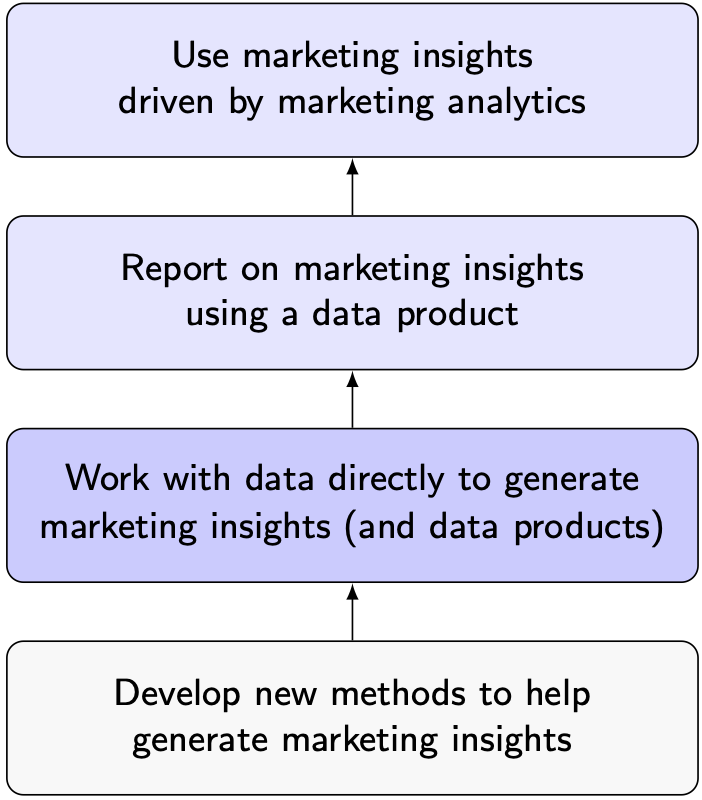
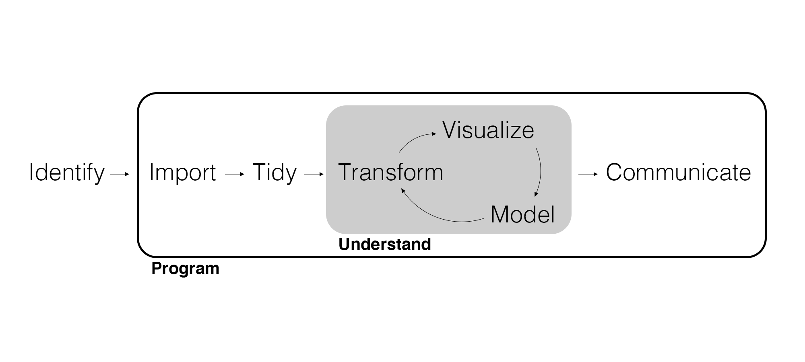

## Marketing Analytics

Analytics is the process of **using data to inform managerial decision-making**.

- What are the key managerial decisions in marketing?
- What is the difference between *inform* and *drive*?
- What are some examples of marketing analytics in practice?

To accomplish this, in this course we will be learning to analyze data in R.

## Share what you learn!

> "Good inspiration is based upon good information." -President Russell M. Nelson (April 2018)

- Bad information can limit inspiration.
- Scientific and spiritual learning run in tandem.
- We need to be willing to learn from evidence.
- Admitting uncertainty isn't a bad thing.

## FAQ | What am I expected to know *now*?

Nothing. (Well, nothing about coding.)

## FAQ | What makes this course different from MKTG 401?

- We focus on **secondary data** instead of **primary data**.
- Secondary data is messy and comes from many different sources.
- This course is a data analysis deep dive: more code, more details, more technical.

## FAQ | What makes this course different from MSB 325?

- This a deeper dive into data analysis.
- Class is interactive.
- Many students find they learn more.

## FAQ | Why are we using R?

R is a free, open-source programming language for statistical computing, analysis, and data science.

- Largest repository of established and new statistical techniques.
- Friendly for non-programmers.
- A very active and helpful community.
- What you can *do* with R is in high demand.

## FAQ | What are we going to do? (What can I put on my resume?)

- Visualize, wrangle, and summarize data.
- Acquire data from a variety of sources (e.g., databases, web scraping).
- Produce reports and interactive dashboards.
- Implement a variety of inferential and predictive models.

## FAQ | Wait, can't I use _____ to do that?

- You'll find that no single programming language is the *best* at everything.
- I switch between R and Python for different tasks for the same project.
- R is the most *accessible*, general-purpose data analysis tool I can teach you.

## FAQ | My internship/job expects me to know Python. How do I learn it?

Python is also a general-purpose data analysis tool, it just isn't as *accessible* as R is. However, many jobs require you to know Python.

- Programming techniques and experience learned in R will make learning additional languages *much* easier.
- The BYU Statistics department has excellent courses to teach you Python.
- If you are interested, I can provide access to resources for self-driven study.

## FAQ | How do I study for a class like this?

1. Seek learning by study and faith (D&C 109:7).
2. Prepare for class by previewing material and coming with questions.
3. Actively code, take notes, and ask questions during class.
4. Practice coding by completing exercises and referencing supplementary material as needed.
5. Review exercise solutions and note where and why your work differs.
6. Use the quizzes to gauge how well you understand the material.
7. Work with classmates and utilize office hours.
8. Download and organize all course materials, notes, and code.

## FAQ | What's the best way to learn how to code?

1. Learn by doing: Code in class and complete exercises.
2. Pay *careful* attention to details. READ SLOWLY.
3. Don't code from scratch. Start with previous work and solutions.
4. Look at and emulate good code.
5. Literally sketch what transformed data should look like in the end.

## FAQ | How will this help me in the future?

{width=375px}

## FAQ | How am I going to be graded?

|                                              |     |
| :------------------------------------------- | :-: |
| Exercises                                    | 20% |
| Quizzes                                      | 30% |
| Projects                                     | 50% |

## FAQ | How can I get help?

- Email me: [cameron.bale@byu.edu](mailto:cameron.bale@byu.edu)
- Office Hours: [By appointment](https://calendly.com/camdbresearch/30min)
- Contact the TA: [esbudge@student.byu.edu](mailto:esbudge@student.byu.edu), Phone: 636-226-5419 (for emergencies only, or if email unanswered after 72 hours.)
- Go to TA office hours: 4pm - 6pm Mondays and Wednesdays. [Zoom link](https://byu.zoom.us/j/5731989983).
- Reference slides, class notes, and supplementary material *first*.

## FAQ | What role will generative AI play in this class?

It's important to know how to use AI in an ethical and helpful way. This class has been designed with the intent that students can and should use generative AI (e.g. ChatGPT) to help them debug their code. However, one of the most valuable skills you'll gain through this course is the ability to think critically about how to solve business problems using data. I hope you will use AI as a tool to help you get your own original ideas across, not as a crutch to avoid stretching your brain.

## FAQ | How is marketing analytics used in practice?

This class provides three detailed demonstrations of how marketing analytics is used in practice. Each unit is motivated by a case study with a corresponding data set.

- We use the case study data in class for the entire unit.
- You'll use the case study data for the exercises.
- Each unit culminates in a project where you'll be introduced to a new scenario and data source, and required to demonstrate the skills you've learned.

## FAQ | How difficult is this going to be?

- The beginning of the semester can have a **steep learning curve**. The first unit will likely be the most time consuming.
- Project weeks can be more intense than other weeks.
- Otherwise, expect the usual two hours a week for every hour spent in class (your mileage may vary).

## FAQ | How do I avoid getting overwhelmed?

> "There is no way to go from knowing nothing about a subject to knowing something about a subject without going through a period of much frustration and suckiness. Push through. You'll suck less." -Hadley Wickham

- Don't be afraid of this **learning pit**.
- You aren't alone.
- If you commit to learning, I'll gladly walk with you.
- Learn something hard now while you have help.
- Please be patient with yourself, me, and others.

## Be *Generous* to Each Other

Justin Collings, Academic Vice President (Remember the Alamo Bowl):

''Ultimately, I suggest, *generosity* is about recognizing and honoring a common familial bond with our fellow children of God. It is by virtue of that recognition that 'all relationships within the BYU community [can] reflect devout love of God and a loving, genuine concern for the welfare of our neighbor.'''

---

{width=500px}

## Marketing Analytics Process

{width=900px}

## Identify | Specify the Managerial Problem and Evaluate Data

One of the most important skills you will gain over the course of the semester is the ability to recognize business pain points and translate them into specific and actionable analyses.

You will also learn how to synthesize data from multiple sources, and ask questions that can reasonably be answered based on the available data.

Good marketing analytics begins with asking the right questions and obtaining the right data.

## Import | Acquire the Needed Data

While primary data is gathered specifically to serve the research objectives at hand, secondary data was gathered for another purpose. Consult the original and most current source whenever possible and understand its context (i.e., use the **data dictionary**).

- Who collected it?
- Why was it collected?
- When was it collected?
- What was collected?
- How was it collected?

Acquiring secondary data may require interacting with databases, using APIs,  web scraping, etc.

## Tidy and Transform | Wrangle the Data

Secondary data can be **messy**. Data wrangling includes whatever tidying, cleaning, mutating, selecting, transforming, renaming, fusing, or filtering is needed to get the data into the needed form to summarize and model.

This can be *tedious*, but it is a vital analytics skill.

## Visualize | Summarize the Data

Summarizing data is initially about discovery. It includes computing **statistics** (i.e., numerical summaries) and creating **data visualizations** (i.e., graphical summaries).

- Summarizing data is closely tied with data wrangling.
- Summarizing data is often not an end in itself.

## Model | Inference and Prediction

Models *extract information* from the data to inform our managerial decision.

- In order to inform the marketing mix, the models we use are often inferential.
- Some managerial decisions only rely on prediction.

## Communicate | Report and Create Data Products

Effectively communicating marketing insights brings us full circle and highlights the necessity of domain expertise.

The analyst needs to **interpret results in a way that clearly informs the managerial decision**. You may hear this referred to as "storytelling."

## Wrapping Up

*Summary*

- Defined marketing analytics.
- Discussed the FAQ.
- Walked through the marketing analytics process.

*Next Time*

- Getting started with R.
- Transforming data with {dplyr}.

*Artwork by @allison_horst*

## Exercise 1

1. Read the syllabus.  
2. Download and install the latest version of [R and RStudio](https://posit.co/download/rstudio-desktop/) (in that order). (If you have a Mac, note the difference between Intel and Apple silicon!)  
3. Email me with questions or concerns you haven't had answered and/or what topics you're most excited to cover.  
4. Read the following prompt and write about what kind of data you would need, and how you might try to analyze it to meet the company's needs (no more than 1 page):  
   *You’ve been hired by a local gym that offers fitness classes, personal training, and online workout subscriptions. Lately, the owner has noticed that while many people sign up for free trials, only a small percentage of them become paying members. They want to understand why more people aren’t converting — and how to improve sign-ups, engagement, and retention.*  
5. Submit your response as a Word document on Canvas by the beginning of class Tuesday and be prepared to share with the class.

