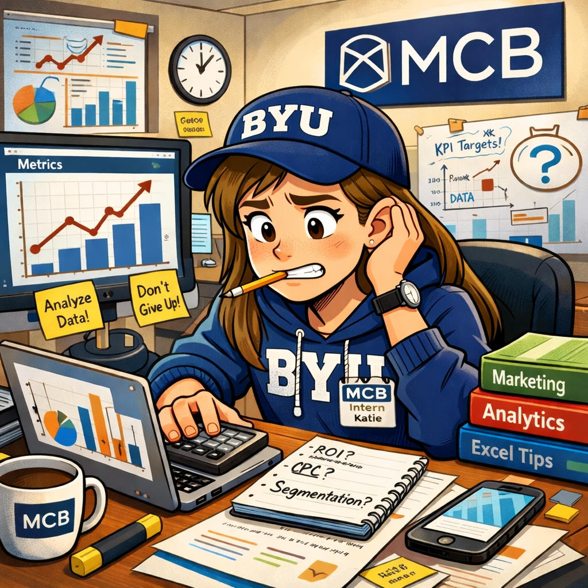
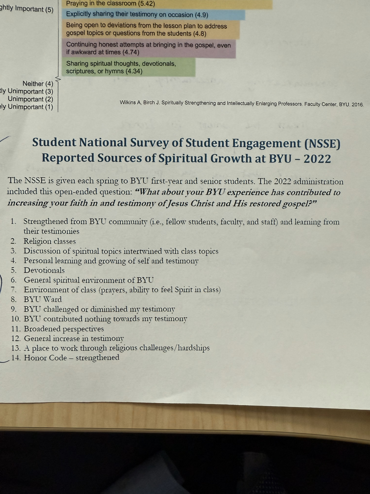
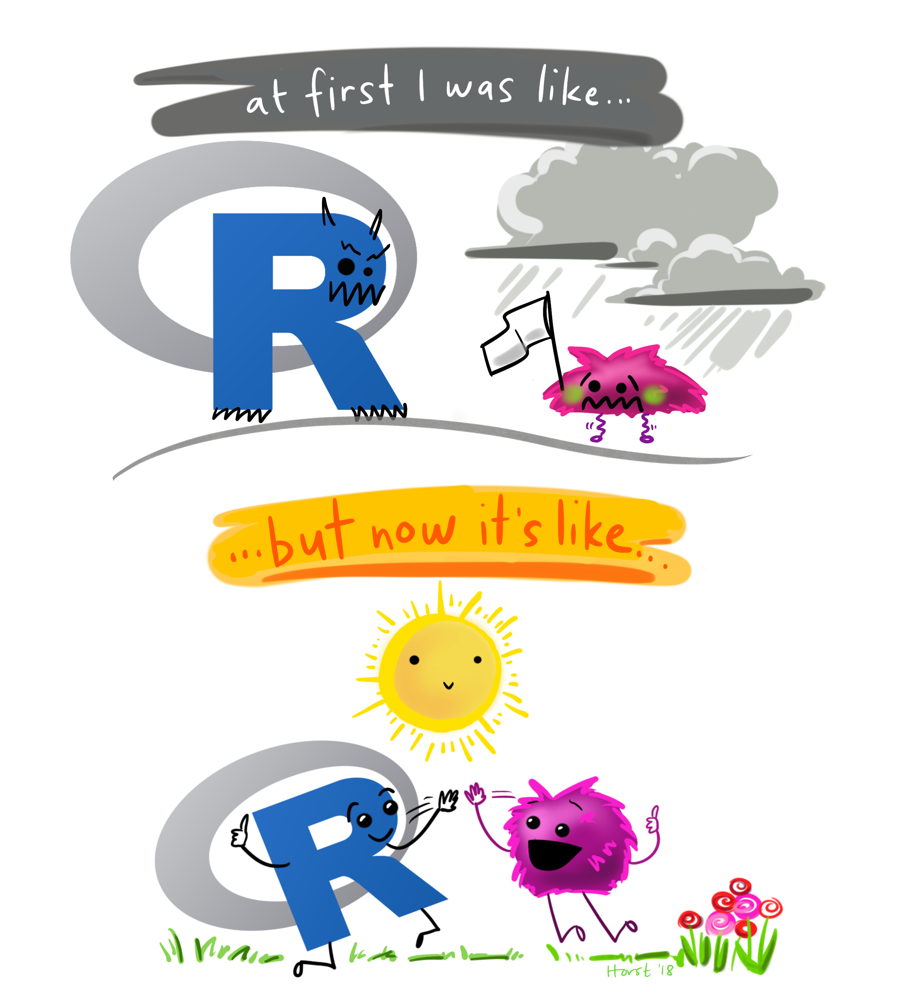
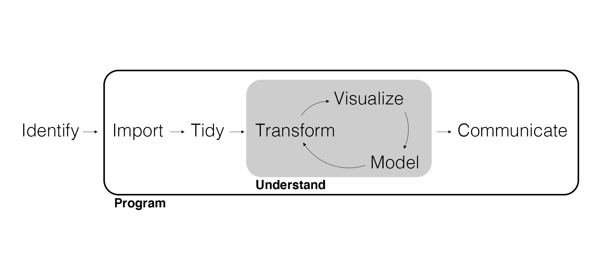
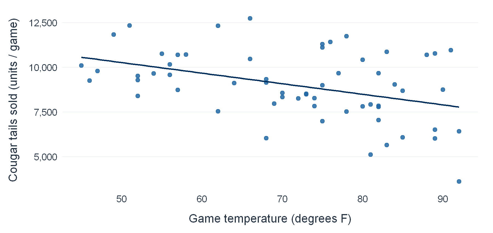
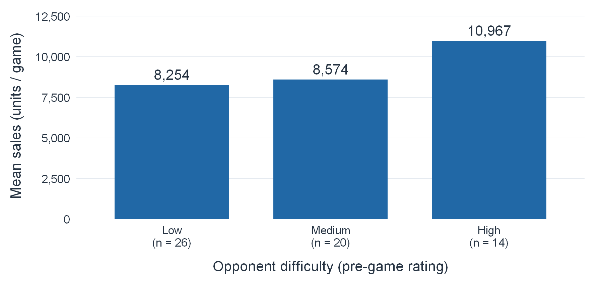
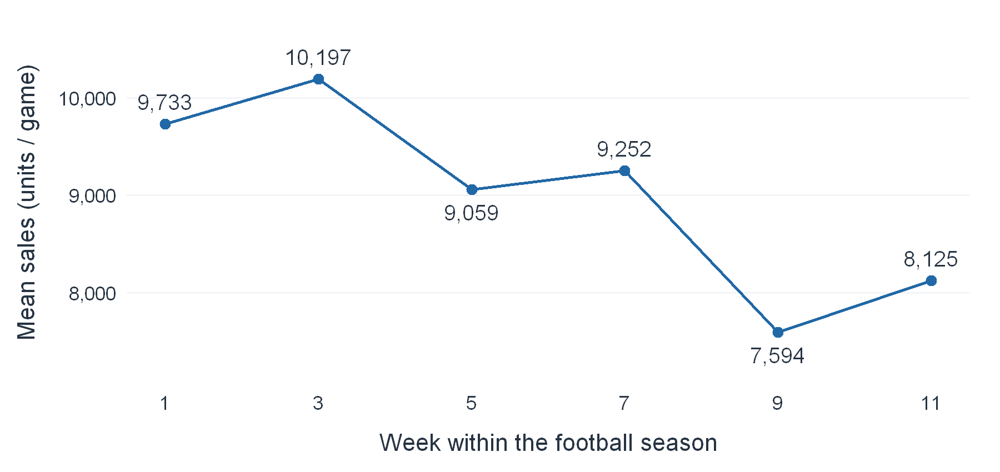

## Congratulations on Your New Job!

You are a new consultant with the MCB Consulting Group.

(Note: this is not an **actual** job, nor will you receive any monetary compensation.)

{width=400px}

## MCB Was Founded in 2017

## The Founders Began Moonlighting as BYU Profs. in 2024

{width=300px}

{width=300px}

## So We've Hired Co-CEOs to Help Run Things

## We've Brought On a New Angel Investor!

She joined us last Friday.

## And I've Hired You to Do Analytics!

{width=600px}

## You Will Interact with the CAO (Me) and our Senior Analytics Partners

{width=300px}

{width=300px}

## Marketing Analytics uses Data to Inform Managerial Decision Making

- What are the key managerial decisions in marketing?
- What is the difference between *inform* and *drive*?

To accomplish this, we will be learning to analyze data in R.

## If you "Show Up", You Can Obtain the Following (Learning Objectives)

- Increased faith in Jesus Christ and the confidence to conduct analyses in R and communicate practical, business-relevant results.
- The ability to analyze with integrity by documenting decisions, identifying limitations in data and models, and quantifying uncertainty.
- The motivation to improve continually and take responsibility for mistakes.
- The ability to recognize and cultivate excellence in your analytical work and that of others.

## You Will Submit Three Types of Deliverables for Evaluation

- Skill-Building Exercises
  - due at the start of every class
  - self-evaluation due exactly one week after the exercise is due (I will provide a rubric)
- Knowledge Checks
  - About 20 written questions, administered in class
  - One completed at the end of each unit
  
## You Will Submit Three Types of Deliverables for Evaluation

- Projects
  - A "client" provides data and a list of problems - you put together an analysis to address one of the problems
  - Evaluated by each senior analytics partner, given the median score
  - Includes an evaluation of another consultant's project

## FAQ | What am I expected to know *now*?

- Basic statistics: have a notion of probability, mean, median, and similar concepts.
- Familiarity with hypothesis testing and regression is a bonus.
- No prior coding experience is required.

## FAQ | What makes this course different from MKTG 401?

- We focus on **secondary data** instead of **primary data**.
- Secondary data is messy and comes from many different sources.
- This course is a data analysis deep dive: more code, more details, more technical.

## FAQ | What makes this course different from MSB 325?

- This a deeper dive into data analysis.
- Class is interactive.
- Many students find they learn more.

## FAQ | Why are we using R?

R is a free, open-source programming language for statistical computing, analysis, and data science.

- Largest repository of established and new statistical techniques.
- Friendly for non-programmers.
- A very active and helpful community.
- What you can *do* with R is in high demand.

## FAQ | Would I Ever Use R Outside the Classroom?

**YES!**

- [Google: Business and Marketing Data Scientist (U.S.)](https://www.indeed.com/viewjob?jk=16daa824ed50170e)
  - New York, NY or Mountain View, CA; qualifications mention coding with R.
- [Amazon Ads: Marketing Decision Science Data Scientist](https://amazon.jobs/en/jobs/10516132/data-scientist-amazon-ads-marketing-decision-science)
  - Basic qualifications list R among examples of statistical software experience.

*Examples checked September 2, 2026; postings may close.*

[Sources]

- Google, Business and Marketing Data Scientist, Applied Machine Learning, U.S. posting on Indeed: https://www.indeed.com/viewjob?jk=16daa824ed50170e
- Amazon Jobs, Job ID 10516132: https://amazon.jobs/en/jobs/10516132/data-scientist-amazon-ads-marketing-decision-science
- Both postings were checked on September 2, 2026. The Google listing names New York, NY and Mountain View, CA as locations and includes Python, R, and SQL as coding examples. These are examples of career applications, not claims that this course alone meets all job qualifications. Postings may close.

## FAQ | What are we going to do? (What can I put on my resume?)

- Visualize, wrangle, and summarize data.
- Acquire data from a variety of sources (e.g., databases, APIs).
- Implement a variety of inferential and predictive models.
- Translate empirical results into managerial insights.
- Accelerate analytics with desktop AI clients and reusable skill files.

## FAQ | My internship/job expects me to know Python. How do I learn it?

Python is also a general-purpose data analysis tool, it just isn't as *accessible* as R is. However, many jobs require you to know Python.

- Programming techniques and experience learned in R will make learning additional languages *much* easier.
- The BYU Statistics department has excellent courses to teach you Python.
- If you are interested, I can provide access to resources for self-driven study.

## FAQ | Why Learn to Code If AI Can Do It?

- We are past asking, "Should I use AI?" The question is now, "When and how can I use AI?"
- Use AI to complement and accelerate your abilities and productivity, not to replace your effort and learning.
- Knowing how to code lets you read, test, and correct AI's work instead of blindly trusting it.

**You are still responsible for the analysis and the decisions it informs.**

## Deloitte | Verify the Evidence in Client Reports

**What happened (2025):** An AI-assisted report for Australia's government included nonexistent references and a fabricated court quotation. Deloitte corrected the report and repaid nearly **$98,000 of its $440,000 fee**.

**For marketers:** Verify the evidence behind market research, competitor claims, and campaign recommendations. Polished writing does not prove the evidence is real.

[Sources: Associated Press](https://apnews.com/article/ab54858680ffc4ae6555b31c8fb987f3) and [refund reporting](https://psnews.com.au/government-urged-to-get-deloittes-total-fee-returned-for-delivering-a-botched-ai-report/167893/)

[Sources]

- Selected from the user-provided AI Failure Examples.docx.pdf, example 8 (page 3).
- Associated Press, October 7, 2025: https://apnews.com/article/ab54858680ffc4ae6555b31c8fb987f3
- Australian Department of Employment and Workplace Relations, corrected report page: https://www.dewr.gov.au/assuring-integrity-targeted-compliance-framework/resources/targeted-compliance-framework-assurance-review-final-report
- PS News, October 12, 2025, reporting on Senate Estimates: https://psnews.com.au/government-urged-to-get-deloittes-total-fee-returned-for-delivering-a-botched-ai-report/167893/
- Later reporting identifies the repayment as nearly $98,000. The US$290,000 figure in AP's initial story is the currency conversion of the total $440,000 fee, not the repayment amount. Both amounts on this slide are Australian dollars. The department's report page records a further correction on February 3, 2026.
- Human verification is a proposed safeguard; this slide does not claim that all report findings were invalid or that AI produced the entire report.

## We'll Learn to Use AI Together

- AI is progressing rapidly, and the tools keep changing.
- I'm still learning how to use AI properly and to its full potential.
- We'll experiment, check the results, and learn together.
- Using AI thoughtfully is a transferable skill you can bring to any job or field.

## FAQ | How do I study for a class like this?

1. Seek learning by study and faith (D&C 109:7).
2. Prepare for meetings by previewing material and coming with questions.
3. Actively code, take notes, and ask questions during meetings.
4. Practice coding by completing exercises and referencing supplementary material as needed.
5. Review exercise solutions and note where and why your work differs.
6. Use the knowledge checks to gauge how well you understand the material.
7. Work with classmates and utilize office hours.
8. Download and organize all materials, notes, and code.

## FAQ | What's the best way to learn how to code?

1. Learn by doing: Code during meetings and complete exercises.
2. Pay *careful* attention to details. READ SLOWLY.
3. Don't code from scratch. Start with previous work and solutions.
4. Look at and emulate good code.
5. Literally sketch what transformed data should look like in the end.
6. Use AI as a collaborator: ask for suggestions and explanations, not just solutions.

## Analytics Skills Help You Stand Out

In Marketing Week's **2024 Career & Salary Survey**, **36.9%** of more than 3,000 brand-side marketers identified a data and analytics skills gap in their marketing function.

- Data and analytics was the most commonly reported skills gap.
- Business knowledge helps you ask the right questions; analytics helps you answer them with evidence.
- Combining the two helps you turn data into useful marketing recommendations.

[Source: Marketing Week](https://www.marketingweek.com/marketers-data-analysis-skills-gap/)

[Sources]

- Adapted from the user-provided Marketing Analytics Pitch.pptx, slide 4, "Many Marketers Lack Analytics Skills."
- Marketing Week's Career & Salary Survey 2024: https://www.marketingweek.com/marketers-data-analysis-skills-gap/
- The source chart asks whether the business has identified skills gaps in the marketing department. The 36.9% figure concerns a reported team-level gap, not the percentage of individual marketers who lack analytics skills. These are 2024 survey results, not a current-year estimate.

## Analytics Roles Can Be Well Compensated

**Average annual U.S. base salary**

| Role | Average salary |
| :--- | ---: |
| Digital marketer | $61,519 |
| Marketing analyst | $76,781 |

*Source: Indeed salary snapshots, updated October 27, 2025.*

Differences in experience, location, and responsibilities also affect pay.

[Sources]

- Adapted from the user-provided Marketing Analytics Pitch.pptx, slide 5, "Analytics Skills are Well-Compensated!"
- The embedded Indeed screenshots (ppt/media/image4.png and image5.png) report U.S. average annual base salaries updated October 27, 2025. These historical figures are retained from the supplied deck rather than presented as current salaries.
- Digital marketer: $61,519 average, $34,736 low, $108,954 high; 2.4k salaries taken from job postings over the preceding 36 months.
- Marketing analyst: $76,781 average, $48,413 low, $121,773 high; 459 salaries taken from job postings over the preceding 36 months.
- This is a descriptive comparison of different roles and samples, not a causal estimate of the salary premium from learning analytics.

## FAQ | How am I going to be graded?

|                                              |     |
| :------------------------------------------- | :-: |
| Skill-Building Exercises                                    | 20% |
| Knowlege Checks                                      | 30% |
| Projects                                     | 50% |

## FAQ | How can I get help?

- Email me: [cameron.bale@byu.edu](mailto:cameron.bale@byu.edu)
- Office Hours: [By appointment](https://calendly.com/camdbresearch/30min)
- Contact senior analytics partners.
- Reference slides, notes, and supplementary material *first*.
- Use AI as a tutor (we'll see examples of this in class).

## Get Help from the Senior Analytics Partners

- Izzy Smith
    - Contact: [is047894@student.byu.edu](mailto:is047894@student.byu.edu)
    - Office Hours: M/W 3:30-4:30pm, Th 1:00-1:30pm (in-person, Blue Line)

- Paige Flake
    - Contact: [paigeef@student.byu.edu](mailto:paigeef@student.byu.edu)
    - Office Hours: M/W 8:30-9:45am (in-person, Blue Line)

## FAQ | What role will generative AI play in this class?

Artificial intelligence (AI) is an important analytics tool, and employees may use it to understand and write code. Employees must also regulate their own use. [Early-stage research](https://arxiv.org/pdf/2506.08872v1) suggests that active AI use may weaken learning during tasks such as writing or coding. We must balance the firm's productivity with each employee's intellectual and spiritual growth.

The gospel helps reconcile temporal and spiritual priorities. The following excerpt from ["Things as They Really Are 2.0"](https://www.churchofjesuschrist.org/study/broadcasts/worldwide-devotional-for-young-adults/2024/11/13bednar?lang=eng) offers useful perspective:

## Remember to Work Toward What God Wants You to Become

"Now, I believe AI appropriately can assist in gathering information, critiquing our thinking, evaluating our writing style, and accelerating an iterative process of learning “line upon line [and] precept upon precept.” But the divine capacities to create and work belong uniquely to each of us as sons and daughters of God. We undoubtedly can generate and produce fabulous content for [school/church/work] with AI. But the objective is not merely producing or presenting impressive content; rather, it is working and becoming what God intends and yearns for us to become."

## Keep These Principles in Mind

- AI is a *tool*, neither good nor bad on its own. It can gather information and critique thinking, writing, or code, but it is not a source of truth and cannot replace personal revelation.
- Overreliance on AI can foster spiritual and temporal laziness. The work and learning process matters as much as the final product.
- AI cannot simulate or replace the influence of the Holy Ghost. Spiritual discernment remains essential.
- AI should supplement, not replace, human work, creativity, and divine capacities.

Remember - do not be "transformed from [employees] who can act into objects that are only acted upon."

## FAQ | How is marketing analytics used in practice?

This class provides three detailed demonstrations of how marketing analytics is used in practice. Each unit is motivated by a case study with a corresponding data set.

- We use the case study data in class for the entire unit.
- You'll use the case study data for the exercises.
- Each unit culminates in a project where you'll be introduced to a new scenario and data source, and required to demonstrate the skills you've learned.

## FAQ | How difficult is this going to be?

- The beginning of the semester can have a **steep learning curve**. The first unit will likely be the most time consuming.
- Project weeks can be more intense than other weeks.
- Otherwise, expect the usual two hours a week for every hour spent in class (your mileage may vary).

## FAQ | How do I avoid getting overwhelmed?

- You aren't alone.
- If you commit to learning, I'll gladly walk with you.
- Learn something hard now while you have help.
- Please be patient with yourself, me, and others.

## Be *Generous* to Each Other

Justin Collings, Academic Vice President:

''Ultimately, I suggest, *generosity* is about recognizing and honoring a common familial bond with our fellow children of God. It is by virtue of that recognition that 'all relationships within the BYU community [can] reflect devout love of God and a loving, genuine concern for the welfare of our neighbor.'''

## I Want You In Discovery Mode!

Our brains process the world in two ways:

- Discovery Mode: you are curious and explorative, eager to try things, learn, and take calculated risks.
- Defense Mode: you are cautious and protective, looking for threats whether real or imagined, and tend to avoid risks and retreat to safety.

Both are necessary - but only one is conducive to effectively learning programming and analytics.

[Get more information here.](https://www.catharticspacecounseling.com/blog/discover-mode-vs-defend-mode-how-your-brain-handles-anxiety) (not an endorsement of the services of Kristen Jacobsen)

## Let's Take Calculated Risks Together

This course contains different programming tasks which build in perceived risk/difficulty:

- You complete a task with a known solution.
- We complete an open-ended task together.
- You complete a (semi) open-ended task on your own.
- You complete an open-ended project, with help available from peers, analytics partners, and the CAO

## I Want Your BYU Experience to Stengthen Your Testimony

{width=500px}

---

{width=500px}

## Questions...?

Let's get an overview of marketing analytics...

## Marketing Analytics Process

{width=900px}

## Identify | Specify the Managerial Problem and Evaluate Data

One of the most important skills you will gain over the course of the semester is the ability to recognize business pain points and translate them into specific and actionable analyses.

You will also learn how to synthesize data from multiple sources, and ask questions that can reasonably be answered based on the available data.

Good marketing analytics begins with asking the right questions and obtaining the right data.

## Cougar Tails | Identify the Planning Problem

**Hypothetical case:** BYU concessions wants to predict cougar tail demand for each home football game next season.

| Resource | Planning decision |
| :--- | :--- |
| Ingredients and packaging | How much should we order, and when? |
| Bakery staff and equipment time | How much time should each campus bakery reserve for cougar tails versus other baked goods? |
| Storage and delivery capacity | How much can we hold and move to the stadium? |

**Too few:** stockouts and missed sales. **Too many:** waste and less capacity for other products.

- This is a fictional teaching scenario, not a description of actual BYU concessions operations.
- The objective is a game-level unit forecast that informs ingredient orders and bakery scheduling across campus.
- In practice, collect stockout times, unsold inventory, and other-product demand. Observed sales can understate demand when supply runs out.
- All case figures and regression estimates come from Case-Study/build_cougar_tail_case.R, using ggplot2 for every chart, an R linear model, and a fixed random seed. No external records or assets were used.
- Assume no stockouts, so recorded sales approximate demand. This teaching assumption is retained in notes rather than on the slide.

## Import | Acquire the Needed Data

While primary data is gathered specifically to serve the research objectives at hand, secondary data was gathered for another purpose. Consult the original and most current source whenever possible and understand its context (i.e., use the **data dictionary**).

- Who collected it?
- Why was it collected?
- When was it collected?
- What was collected?
- How was it collected?

Acquiring secondary data may require interacting with databases, using APIs,  web scraping, etc.

## Cougar Tails | Import Game-Level Records

Join sales, schedules, weather, attendance, and pre-game ratings. **One row = one home game.**

| Date | Week | Temp. (°F) | Attendance | BYU win % | Units sold | Sales ($) |
| :--- | ---: | ---: | ---: | ---: | ---: | ---: |
| 2025-09-06 | 1 | 75 | 61,100 | 25 | 11,108 | 88,864 |
| 2025-09-20 | 3 | **NA** | 58,300 | 55 | 8,747 | 69,976 |
| 2025-10-04 | 5 | 74 | 58,800 | 55 | 8,258 | 66,064 |
| 2025-11-01 | 9 | 81 | 90,000 | 85 | 5,095 | 40,760 |
| 2025-11-15 | 11 | 45 | 58,300 | 85 | 10,091 | 80,728 |

- **NA** = missing.
- **BYU win %** = a pre-game estimate, not the game result.

- The complete synthetic schedule has six home games per season, in season weeks 1, 3, 5, 7, 9, and 11: 60 games total.
- The raw import has 59 rows because the 2025 week-7 game was deliberately omitted. The other planted issues are a missing week-3 temperature and impossible week-9 attendance.
- Sales dollars equal units sold times the assumed constant $8 price. Dollars are an outcome, not a predictor of unit sales.
- The data generator also returns the fictional full schedule and verified source records used in the cleaning example.

## Tidy and Transform | Wrangle the Data

Secondary data can be **messy**. Data wrangling includes whatever tidying, cleaning, mutating, selecting, transforming, renaming, fusing, or filtering is needed to get the data into the needed form to summarize and model.

This can be *tedious*, but it is a vital analytics skill.

## Cougar Tails | Tidy and Check the Records

| Check | Problem in the raw import | Verify against source records |
| :--- | :--- | :--- |
| Missing values | Week 3 temperature is NA | Retrieve game-time readings from a nearby weather station's historical archive. |
| Schedule coverage | Week 7 game is absent | Match the athletics season schedule to concessions' point-of-sale exports; retrieve the missing game's transactions. |
| Reasonable values | Week 9 attendance is 90,000 | Check the stadium's seating capacity and verify attendance against ticket-scan records. |

- The 64,000 capacity is an exercise assumption, not a claim about LaVell Edwards Stadium's current capacity.
- Cross-reference the full season schedule with the sales data using a unique season/game key. A missing row is different from a game with zero sales.
- If a source cannot resolve a missing or impossible value, flag it and document the chosen treatment; do not silently invent a replacement.
- The fictional recovered October 18 record has week 7, temperature 80°F, attendance 59,600, pre-game BYU win probability 25%, 10,411 units, and $83,288 sales.
- The missing temperature is 90°F; corrected week-9 attendance is 49,900. After repairs, there are 60 complete records. In a real project, obtain these values from the sources described in the table rather than assume them.
- Check revenue = units × $8 under this exercise's fixed-price assumption. These repairs restore the same complete records used for all charts and the regression.

## Cougar Tails | Transform a Pre-Game Rating

Turn the estimated BYU win probability into an **opponent difficulty** category:

| Estimated chance BYU wins | Difficulty | Example from the imported records |
| :--- | :--- | :--- |
| 70% or higher | Low | 85% → Low |
| 40% to less than 70% | Medium | 55% → Medium |
| Less than 40% | High | 25% → High |

## Visualize | Summarize the Data

Summarizing data is initially about discovery. It includes computing **statistics** (i.e., numerical summaries) and creating **data visualizations** (i.e., graphical summaries).

- Summarizing data is closely tied with data wrangling.
- Summarizing data is often not an end in itself.

## Cougar Tails | Explore Temperature and Sales

Warmer games tend to have lower sales, with plenty of variation.

Hypothetical data; each dot is one game. The line summarizes association, not causation.

## Cougar Tails | Compare Opponent Difficulty

Average sales are higher against tougher opponents.

Hypothetical data; averages across all 60 games. Other game characteristics differ across groups too.

## Cougar Tails | Look for a Seasonal Pattern

Sales tend to decline across the season, with ups and downs.

Hypothetical data; each point averages the same season week across 10 seasons (10 games per point).

- Align games by week within the season, then average across seasons. A single average for each calendar year would answer a different question.
- The six week averages are 9,733.0; 10,196.6; 9,059.0; 9,252.4; 7,594.4; and 8,125.1 units.
- The irregular line is intentional. Temperature, opponents, attendance, and unmeasured factors vary across games; this is not a causal estimate of the passage of time.

## Model | Inference and Prediction

Models *extract information* from the data to inform our managerial decision.

- In order to inform the marketing mix, the models we use are often inferential.
- Some managerial decisions only rely on prediction.

## Cougar Tails | Model Sales Together

**Outcome: cougar tails sold per game.**

$$
\begin{aligned}
\text{Sales}_i ={}& \beta_0 + \beta_1\text{Week}_i \\
&+ \beta_2\text{Medium}_i + \beta_3\text{High}_i \\
&+ \beta_4\text{Temperature}_i + \beta_5\text{Attendance}_i + \varepsilon_i
\end{aligned}
$$

- **Week, temperature (°F), and attendance (people)** enter as continuous variables.
- **Medium** and **High** are 0/1 indicators; **Low** is the reference category.
- Each row is a game; the error term captures unexplained variation.

## Cougar Tails | Read the Model Results

**Linear regression of unit sales.**

| Model term | Estimate (units) | Standard error |
| :--- | ---: | ---: |
| Intercept | 8,250 | 2,492 |
| Season week: 1 week later | −270 | 39 |
| Medium difficulty vs. Low | +776 | 282 |
| High difficulty vs. Low | +2,292 | 340 |
| Temperature: 1°F warmer | −94.77 | 9.61 |
| Attendance: 1 more person | +0.150 | 0.046 |

- The displayed coefficients and standard errors are rounded from an actual OLS fit to the same synthetic data shown earlier; they are not independently invented table entries.
- Formula: units ~ season_week + difficulty + temperature_f + attendance. Temperature and attendance are unbinned numeric variables in their original units; Low difficulty is the reference category, not an equally spaced numeric rating.
- The intercept is the fitted value at week 0, temperature 0°F, attendance 0, and Low difficulty. That combination is outside the observed range; use the full equation for realistic games, not the intercept on its own.
- Each coefficient is an association holding the other included predictors constant, not a causal effect. In-sample R-squared is 0.788, not a forecast accuracy score.
- The date is represented by season week. The win-probability estimate is represented by the difficulty categories. Revenue is deliberately excluded because it is calculated directly from units sold.
- In real forecasting, use the known schedule and pre-game difficulty estimates plus forecast temperature and expected attendance, not future actual observations. Revisit forecasts as game day approaches.
- Standard errors are conventional OLS standard errors for illustration. This toy model is not validated for real BYU decisions; use a held-out season to assess prediction error and uncertainty before relying on it.

## Communicate | Report and Create Data Products

Effectively communicating marketing insights brings us full circle and highlights the necessity of domain expertise.

The analyst needs to **interpret results in a way that clearly informs the managerial decision**. You may hear this referred to as "storytelling."

## Cougar Tails | Communicate the Findings

**In this hypothetical dataset:**

- Warmer temperatures and later season weeks are **associated with lower sales**.
- Tougher opponents and larger crowds are **associated with higher sales** in the fitted model.
- The patterns may help forecast demand; they do **not** show that changing temperature or opponents would cause sales to change.

Use game-level forecasts to plan ingredient orders and bakery time, with a buffer for uncertainty and room for other baked goods.

## Cougar Tails | Brief Concessions Managers

**Upcoming game:** Week 3, High difficulty, 70°F, 60,000 attendees.

| Planning measure | Takeaway |
| :--- | :--- |
| Expected sales | About **12,100 tails** |
| 80% model prediction interval | About **10,800–13,300 tails** |
| Production target | **13,300 tails** |

Reserve inventory and production capacity for the target. Update the plan as weather and attendance forecasts change.

We use the upper interval amount to balance the risk of missed sales against waste; it is not a guarantee that we won't sell out.

- All scenario inputs are teaching assumptions. The model fitted to all 60 synthetic games predicts 12,079 units, with an 80% OLS prediction interval of 10,827–13,331 units for a single upcoming game.
- The displayed forecast and interval are rounded to the nearest hundred. The production target uses the upper prediction limit with the same rounding: round(13,331 / 100) × 100 = 13,300.
- Choosing the upper interval amount is a management decision, not a statistically optimized inventory policy. The model prediction interval is conditional on the supplied predictor values and does not include uncertainty in future weather or attendance inputs.
- The case assumes no historical stockouts. Actual forecasting would also need stockout records and evaluation across more held-out seasons.

## Cougar Tails | Brief Bakery and Purchasing

Assume each baker can produce **1,200 tails** in a 12-hour window. We need **12 bakers**: 11 can produce only 13,200.

| Production assignment | Staff allocation |
| :--- | ---: |
| Cougar tails | 12 bakers |
| Mint brownies | 2 additional production staff |
| Kettle corn | 2 additional production staff |
| **Total** | **16 people** |

Stage ingredients for **133 batches of 100 tails** and 13,300 sleeves.

- Production rates, staffing, batch size, and packaging requirements are assumptions for the classroom case, not verified BYU operating standards.
- Required cougar-tail bakers = ceiling(13,300 / 1,200) = 12. Their combined capacity is 14,400, but the production target remains 13,300 rather than automatically using all capacity.
- The 1,200-tail capacity is each baker's total contribution within the 12-hour production window, not a requirement for a continuous 12-hour shift; schedule breaks and coverage within that capacity assumption.
- The staffing plan reserves two additional people for mint brownies and two for kettle corn, for 16 total. These other-product allocations are planning assumptions, not outputs of the cougar-tail model.
- Ingredients come from the recipe bill of materials for 133 batches of 100 tails. Check on-hand usable ingredients, packaging, supplier lead times, equipment capacity, storage, and delivery before committing the schedule across campus bakeries.

## Cougar Tails | Brief the Analytics Team

- **Temperature:** 1°F warmer is associated with about **95 fewer units**, holding the other included predictors constant.
- **Attendance:** 1,000 more people is associated with about **150 more units**, under the same adjustment.

| 2025 holdout: 6 games | Mean absolute error |
| :--- | ---: |
| Regression trained on 2016–2024 | **671 tails per game** |
| Always predict the training-set mean | **1,585 tails per game** |

The model improves on this simple baseline. Monitor forecast error by game.

- Validation uses a separate fit on 54 games from 2016–2024 and tests on six games from 2025. Neither the coefficients nor the baseline mean use holdout outcomes.
- After validation, the presentation's coefficient table and upcoming-game forecast use a refit on all 60 records. Both sets of results are calculated by Case-Study/build_cougar_tail_case.R.
- These are retrospective predictions using observed weather and attendance; operational evaluation should use the forecasts available when ingredient and staffing decisions are made.
- One six-game holdout is not enough to establish operational reliability. Check multiple held-out seasons, prediction-interval coverage, and whether stockouts censor demand before deployment.

## Wrapping Up

*Summary*

- Defined marketing analytics.
- Discussed the FAQ.
- Walked through the marketing analytics process.

*Next Time*

- Getting started with R.
- Transforming data with {dplyr}.

*Artwork by @allison_horst*

## Exercise 1

1. Read the syllabus.  
2. Download and install the latest versions of [R](https://cran.r-project.org/) and [RStudio Desktop](https://posit.co/download/rstudio-desktop/) (in that order). (If you have a Mac, note the difference between Intel and Apple silicon!)  
3. Email me with questions or concerns you haven't had answered and/or what topics you're most excited to cover.  
4. Read the following prompt. Write about what kind of data you would need and how you might try to analyze it to meet the company's needs. 
*You are consulting Patagonia to help evaluate the health of its customer base. While the brand has a strong reputation and loyal following, recent internal reports suggest shifts in who is buying Patagonia products — including changes in age, income level, geographic location, and shopping habits. Your task is to determine how healthy Patagonia’s current customer base is and identify potential gaps or emerging trends.*
5. Submit your response as a Word document on Canvas by the beginning of class Tuesday.

